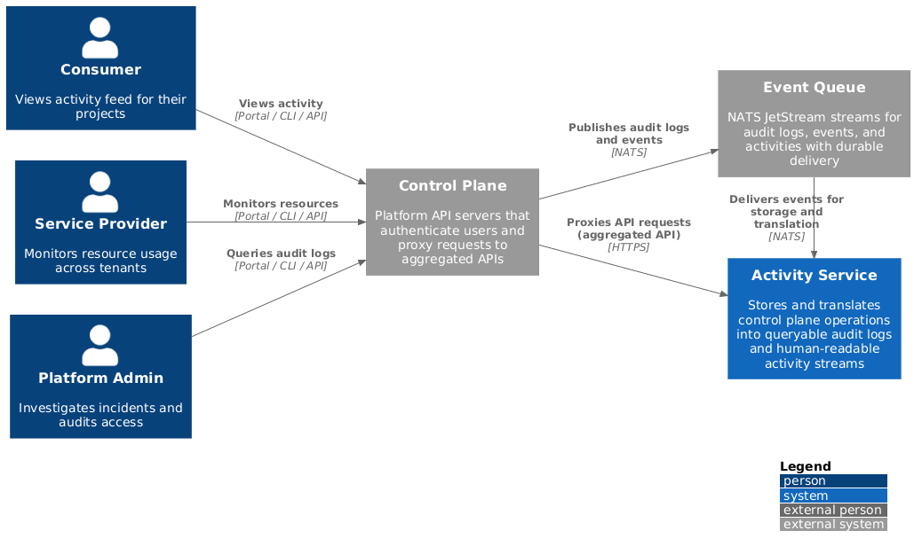

# Activity Service Architecture

The activity service provides platform consumers with visibility into what's
happening across their infrastructure. It captures, stores, and translates
control plane operations into queryable audit logs, events, and human-readable
activity streams.

## How It Works

When users interact with the platform—creating resources, updating
configurations, or deleting workloads—the control plane generates audit logs
that capture every API operation. Control plane components also emit events to
report status changes like "**resource is ready**" or "**provisioning failed**".

The activity service collects these audit logs and events, stores them for
long-term querying, and translates them into human-readable activity summaries.
This gives platform users three complementary views:

- **Audit Logs**: The authoritative record of who did what and when, used for
  compliance, security investigation, and debugging
- **Events**: Status updates from control plane components showing resource
  lifecycle and health
- **Activities**: Human-readable summaries like "***Alice created an HTTP proxy
  for myservice.com***" that filter out system noise and highlight what matters

Users query all three through the control plane API, with support for real-time
streaming.

## System Context



The control plane publishes audit logs and events to a durable message queue,
which provides reliable delivery and buffering. The activity service consumes
these events, stores them for long-term analytics, and serves queries through an
API that integrates seamlessly with kubectl and the platform portal. The system
is built on proven open-source technologies.

## Core Concepts

### Data Types

- **[Audit Logs](./audit-pipeline.md)**: Generated by the API server for every
  API operation. Used for compliance, security investigation, and debugging.
- **[Events](./event-pipeline.md)**: Emitted by control plane components to
  report resource status and lifecycle changes.
- **[Activities](./activity-pipeline.md)**: Human-readable summaries translated
  from audit logs and events, filtering out system noise.

### Multi-Tenancy

The system isolates data by tenant scope:

- **Platform**: All data across all tenants
- **Organization**: Data within a specific organization
- **Project**: Data within a specific project
- **User**: Actions performed by a specific user

Review the [multi-tenancy architecture](./multi-tenancy.md) documentation for
more information.

> [!NOTE]
>
> Scopes are not hierarchically inclusive. Organization-scoped queries do not
> include data from projects within that organization. Query each scope
> directly. This behavior may change in a future release.

### Translation Engine

Service providers define **ActivityPolicy** resources that translate raw audit
logs and events into human-readable activities using CEL expressions. This
policy-based approach allows service providers to:

- **Control their narrative**: Define how their resources appear in activity
  feeds without modifying platform code
- **Deploy independently**: Ship policies alongside their services, updating
  activity descriptions without platform releases
- **Use domain language**: Craft summaries using terminology their users
  understand, not generic technical jargon


This example policy targets `HTTPProxy` resources. When someone creates an
HTTPProxy, the policy matches the `create` verb and generates a summary like
"***Alice created a new HTTP proxy for myservice.com***"—with a clickable link to the
resource.

```yaml
apiVersion: activity.miloapis.com/v1alpha1
kind: ActivityPolicy
metadata:
  name: networking-httpproxy
spec:
  resource:
    apiGroup: networking.datumapis.com
    kind: HTTPProxy
  auditRules:
    - match: "audit.verb == 'create'"
      summary: "{{ actor }} created {{ link(kind + ' ' + audit.objectRef.name, audit.responseObject) }}"
```

See [Activity Pipeline](./activity-pipeline.md) for details.

## Technology Stack

| Component | Technology | Purpose |
|-----------|------------|---------|
| **Message Broker** | [NATS JetStream](https://docs.nats.io/nats-concepts/jetstream) | Durable event buffering with ordering guarantees |
| **Data Pipeline** | [Vector](https://vector.dev/) | Receive, transform, and route data between components |
| **Storage** | [ClickHouse](https://clickhouse.com/docs) | Stores audit logs, events, and activities for long-term querying |
| **Policy Storage** | [etcd](https://etcd.io/) | ActivityPolicy persistence with Watch support |
| **API Framework** | [Aggregated API](https://kubernetes.io/docs/concepts/extend-kubernetes/api-extension/apiserver-aggregation/) | Native kubectl integration |

## API Resources

The Activity API Server exposes these resources under
`activity.miloapis.com/v1alpha1`:

| Resource | Type | Description |
|----------|------|-------------|
| `AuditLogQuery` | Ephemeral | Execute audit log searches |
| `AuditLogFacetsQuery` | Ephemeral | Get distinct values for filter autocomplete |
| `Activity` | Read-only | Query translated activity records |
| `ActivityFacetQuery` | Ephemeral | Get distinct activity field values |
| `ActivityPolicy` | Persistent | Define translation rules for resource types |
| `PolicyPreview` | Ephemeral | Test policies against sample inputs |

See the [API Reference](../api.md) for complete documentation.

## Learn More

Dive deeper into specific areas of the system:

- [Audit Pipeline](./audit-pipeline.md) — Audit log collection and storage
- [Event Pipeline](./event-pipeline.md) — Event storage replacement
- [Activity Pipeline](./activity-pipeline.md) — Activity translation and streaming
- [Live Streaming](./live-streaming.md) — Real-time Watch API via NATS consumers
- [Data Model](./data-model.md) — ClickHouse schemas and indexes
- [Multi-tenancy](./multi-tenancy.md) — Scope model and isolation
- [Observability](./observability.md) — Metrics, tracing, and dashboards
- [API Server Architecture](../components/apiserver-architecture.md) — Aggregated API server internals

## References

- [Kubernetes
  Auditing](https://kubernetes.io/docs/tasks/debug/debug-cluster/audit/)
- [Events](https://kubernetes.io/docs/reference/kubernetes-api/cluster-resources/event-v1/)
- [Aggregated API
  Servers](https://kubernetes.io/docs/concepts/extend-kubernetes/api-extension/apiserver-aggregation/)
- [Common Expression Language (CEL)](https://cel.dev)
- [NATS JetStream](https://docs.nats.io/nats-concepts/jetstream)
- [ClickHouse Documentation](https://clickhouse.com/docs)
