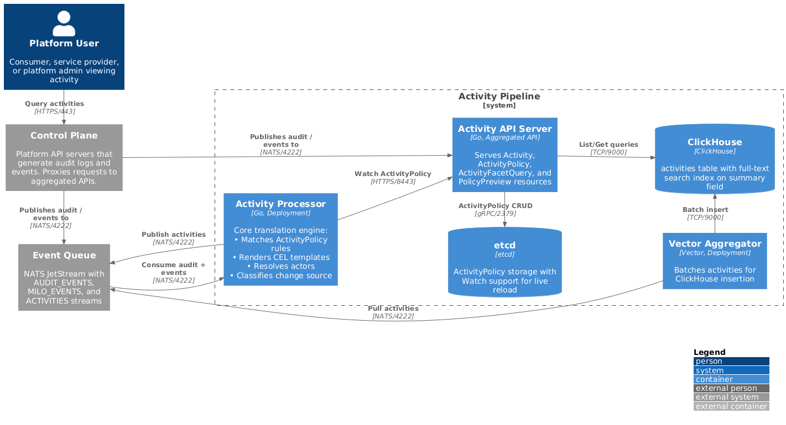

# Activity Pipeline

The activity pipeline translates raw audit logs and Kubernetes events into
human-readable activity records. It provides consumers, service providers, and
platform administrators with a unified view of resource changes.

## Overview



## Input Sources

The activity system consumes two distinct input sources from the Kubernetes
control plane:

**Audit Logs** are generated by the Kubernetes API server for every API request.
They capture who made a request, what operation was performed, which resource
was affected, and the request/response bodies. Audit logs are the authoritative
record of all API interactions.

**Kubernetes Events** are created by controllers to report status changes and
noteworthy occurrences during reconciliation. Events indicate things like
"resource is now ready," "configuration was rejected," or "provisioning failed."

The activity system combines these sources to produce a unified stream: audit
logs provide the "who" and "what," while events provide the "status" and
"outcome."

## Components

### Activity Processor

The Activity Processor is the core translation engine:

| Responsibility | Description |
|----------------|-------------|
| NATS Consumer | Consumes from AUDIT_EVENTS and MILO_EVENTS streams |
| Policy Matcher | Loads compiled policies from cache, matches by apiGroup/kind |
| Template Evaluator | Renders CEL templates with `{{ }}` expressions |
| Actor Resolver | Extracts actor from user fields, classifies type |
| Change Classifier | Determines human vs system based on patterns |
| NATS Publisher | Publishes Activity records to ACTIVITIES stream |

### Vector Aggregator

Consumes from the ACTIVITIES stream and batches inserts into ClickHouse.

### Activity API Server

Serves Activity and ActivityPolicy resources via the Kubernetes aggregated API
pattern. See [API Server Architecture](../components/apiserver-architecture.md).

## ActivityPolicy

Service providers create **ActivityPolicy** resources to define how their
resources appear in the activity stream:

```yaml
apiVersion: activity.miloapis.com/v1alpha1
kind: ActivityPolicy
metadata:
  name: networking-httpproxy
spec:
  resource:
    apiGroup: networking.datumapis.com
    kind: HTTPProxy

  auditRules:
    - match: "audit.verb == 'create'"
      summary: "{{ actor }} created {{ link(kind + ' ' + audit.objectRef.name, audit.responseObject) }}"

    - match: "audit.verb == 'delete'"
      summary: "{{ actor }} deleted {{ link(kind + ' ' + audit.objectRef.name, audit.responseObject) }}"

    - match: "audit.verb in ['update', 'patch']"
      summary: "{{ actor }} updated {{ link(kind + ' ' + audit.objectRef.name, audit.responseObject) }}"

  eventRules:
    - match: "event.reason == 'Programmed'"
      summary: "{{ link(kind + ' ' + event.regarding.name, event.regarding) }} is now programmed"

    - match: "event.reason == 'Ready'"
      summary: "{{ link(kind + ' ' + event.regarding.name, event.regarding) }} is ready"

    - match: "true"  # Fallback
      summary: "{{ link(kind + ' ' + event.regarding.name, event.regarding) }}: {{ event.reason }}"
```

### CEL Variables

Different variables are available depending on the rule type:

**Audit Rules:**
- `audit` - Full Kubernetes audit event structure
- `kind` - Human-readable kind label (e.g., "HTTP proxy")
- `kindPlural` - Plural form (e.g., "HTTP proxies")
- `actor` - Resolved display name for the actor

**Event Rules:**
- `event` - Full Kubernetes Event structure
- `kind`, `kindPlural`, `actor` - Same as audit rules

### Link Function

The `link()` function creates clickable references in the portal:

```
link(displayText, resourceRef)
```

Example: `{{ link(kind + " " + audit.objectRef.name, audit.responseObject) }}`

This produces "HTTP proxy api-gateway" in the summary and registers it as a
clickable link to the resource.

### Kind Labels

Human-readable kind labels are discovered from CRD annotations:

```yaml
apiVersion: apiextensions.k8s.io/v1
kind: CustomResourceDefinition
metadata:
  name: httpproxies.networking.datumapis.com
  annotations:
    activity.miloapis.com/kind-label: "HTTP proxy"
    activity.miloapis.com/kind-label-plural: "HTTP proxies"
```

If no annotation is present, labels are derived by inserting spaces before
capital letters (e.g., "NetworkContext" → "Network Context").

## Change Source Classification

Activities are classified by their change source to enable filtering:

| Classification | Description |
|----------------|-------------|
| `human` | User actions via kubectl, API, or UI |
| `system` | Controller reconciliation, operator actions, scheduled jobs |

Classification rules (in priority order):

| Priority | Rule | Result |
|----------|------|--------|
| 1 | `activity.miloapis.com/change-source` annotation | Annotation value |
| 2 | Username matches `system:serviceaccount:kube-system:*` | System |
| 3 | Username matches `system:*` | System |
| 4 | Audit-sourced with non-system username | Human |
| 5 | Event-sourced activity | System |

## Actor Resolution

Actors are resolved from different sources based on the activity origin:

| Source | Resolution Method |
|--------|-------------------|
| Audit logs | Extract from `audit.user.username`, `audit.user.uid` |
| Events with annotations | Use `activity.miloapis.com/actor-*` annotations |
| Events from controllers | Map `event.reportingController` to a system actor |

Actor types:

| Type | Description | Example |
|------|-------------|---------|
| `user` | Human users via OIDC | `alice@example.com` |
| `serviceaccount` | Kubernetes service accounts | `system:serviceaccount:default:my-sa` |
| `controller` | Kubernetes controllers | `deployment-controller` |

## Activity Resource

The resulting Activity record:

```yaml
apiVersion: activity.miloapis.com/v1alpha1
kind: Activity
metadata:
  name: act-abc123
  namespace: default
  labels:
    activity.miloapis.com/origin-type: audit
    activity.miloapis.com/change-source: human
spec:
  summary: "alice created HTTP proxy api-gateway"
  changeSource: human

  actor:
    type: user
    name: alice@example.com
    uid: user-12345
    email: alice@example.com

  resource:
    apiGroup: networking.datumapis.com
    apiVersion: v1
    kind: HTTPProxy
    name: api-gateway
    namespace: default
    uid: resource-67890

  links:
    - marker: "HTTP proxy api-gateway"
      resource:
        apiGroup: networking.datumapis.com
        kind: HTTPProxy
        name: api-gateway
        namespace: default

  tenant:
    type: project
    name: prod

  origin:
    type: audit
    id: "abc-123-def"
```

## NATS Subject Convention

Activities are published to subjects that support filtering by tenant, API
group, and resource:

```
activities.<tenant_type>.<tenant_name>.<api_group>.<source>.<kind>.<namespace>.<name>
```

### Subject Examples

| Activity | Subject |
|----------|---------|
| User created HTTPProxy | `activities.project.prod.networking_datumapis_com.audit.HTTPProxy.default.api-gateway` |
| Network programmed event | `activities.project.prod.networking_datumapis_com.event.Network.default.prod-network` |

### Wildcard Subscriptions

| Pattern | Use Case |
|---------|----------|
| `activities.project.prod.>` | Consumer: all activities in prod project |
| `activities.*.*.networking_datumapis_com.>` | Service provider: all networking activities |
| `activities.*.*.*.audit.>` | All audit-sourced activities |

## Query API

### Activity List

```
GET /apis/activity.miloapis.com/v1/activities
GET /apis/activity.miloapis.com/v1/namespaces/{ns}/activities
```

Query parameters:

| Parameter | Type | Description |
|-----------|------|-------------|
| `filter` | string | CEL expression to filter activities |
| `search` | string | Full-text search on summaries |
| `start` | string | Start of time range (RFC3339 or relative) |
| `end` | string | End of time range |
| `limit` | int | Maximum results (1-1000) |
| `continue` | string | Pagination cursor |

### Activity Watch

```
GET /apis/activity.miloapis.com/v1/activities?watch=true
```

Watch connects to NATS and streams new activities in real-time. Supports
`resourceVersion` for resuming from a specific point.

### ActivityFacetQuery

Get distinct values for filter autocomplete:

```yaml
apiVersion: activity.miloapis.com/v1
kind: ActivityFacetQuery
spec:
  timeRange:
    start: "now-7d"
  filter: "spec.changeSource == 'human'"
  facets:
    - field: spec.actor.name
      limit: 10
    - field: spec.resource.kind
      limit: 20
```

## Related Documentation

- [Architecture Overview](./README.md)
- [Data Model](./data-model.md) - ClickHouse schema details
- [Multi-tenancy](./multi-tenancy.md) - Scope-based filtering
- [API Reference](../api.md) - Complete Activity and ActivityPolicy specs
