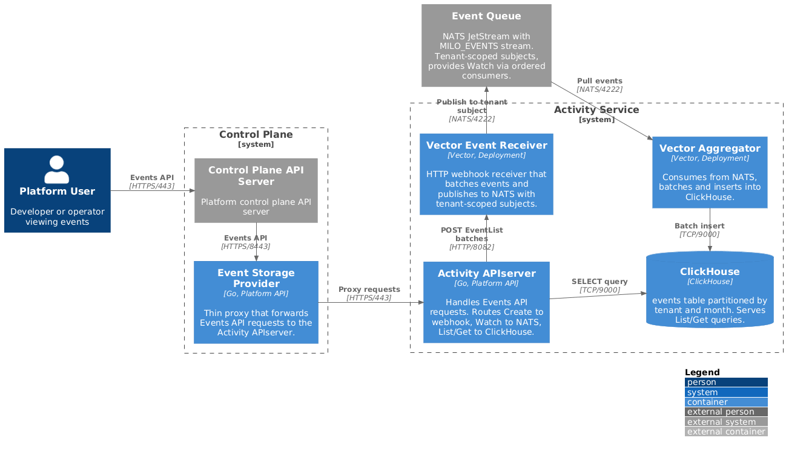

# Event Pipeline

The event pipeline replaces etcd-based storage for Kubernetes Events with a
scalable, queryable backend. This unlocks capabilities that aren't possible
with standard event storage:

- **Long-term retention**: Keep events for days, weeks, or months instead of
  the default 1-hour TTL, enabling historical analysis and debugging
- **Real-time streaming**: Subscribe to events as they happen without polling,
  enabling live dashboards and instant notifications
- **Rich querying**: Filter, aggregate, and analyze events across any dimension
  including time ranges, resource types, namespaces, and custom annotations
- **Multi-tenant isolation**: Events are scoped to tenants with configurable
  retention policies per organization or project
- **Horizontal scaling**: Event storage scales independently of the control
  plane, preventing event storms from impacting cluster stability

The Activity APIserver provides a standard Kubernetes Events API, so existing
tools and integrations work without modification.



## Components

### Event Storage Provider

A custom `rest.Storage` implementation in the control plane that intercepts
Events API requests and proxies them to the Activity APIserver. This thin
proxy layer allows control planes to delegate event handling without embedding
the full storage logic.

### Activity APIserver

The Activity APIserver handles all event operations, routing each to the
appropriate backend:

| Operation | Backend |
|-----------|---------|
| Create | Webhook → NATS → ClickHouse |
| Watch | NATS JetStream ordered consumer |
| List/Get | ClickHouse query |

### Webhook Receiver (Vector)

Receives batched EventLists via HTTP POST, extracts tenant context from
annotations, and publishes to NATS with structured subjects.

### NATS JetStream

The `MILO_EVENTS` stream stores all Kubernetes events:

| Setting | Value | Purpose |
|---------|-------|---------|
| Subjects | `events.>` | Captures all event subjects |
| Retention | Limits-based | Bounded by time and size |
| Max age | 7 days | Buffer for ClickHouse lag |
| Storage | File-based | Durable across restarts |

Two consumer types:
- **clickhouse-ingest**: Durable pull consumer for ClickHouse insertion
- **apiserver-watch-***: Ephemeral ordered consumers for Watch clients

### ClickHouse Storage

See [Data Model](./data-model.md) for the `events` table schema.

## NATS Subject Convention

Events are published to subjects using a flat tenant model:

```
events.<tenant_type>.<tenant_name>.<api_group_kind>.<namespace>.<involved_name>
```

The kind is fully qualified with the API group using `_` as a separator. Dots in
API groups are replaced with underscores (e.g., `networking.k8s.io` becomes
`networking_k8s_io`). The core API group uses `core` as the group name.

### Subject Examples

| Scope | Subject |
|-------|---------|
| Project workload | `events.project.prod-cluster.apps_Deployment.default.nginx` |
| Organization setting | `events.organization.acme.platform_miloapis_com_OrgMembership._.alice` |
| User session | `events.user.alice.auth_miloapis_com_Session._.sess-12345` |
| Global/cluster | `events.global._.core_Node._.worker-1` |

### Wildcard Subscriptions

| Pattern | Matches |
|---------|---------|
| `events.project.prod-cluster.>` | All events in prod-cluster project |
| `events.organization.acme-corp.>` | All events for acme-corp organization |
| `events.project.*.apps_Deployment.>` | All Deployment events across projects |

## resourceVersion Strategy

NATS JetStream sequence numbers serve as resourceVersion:

- Globally ordered within the stream
- Monotonically increasing
- Assigned by NATS on publish acknowledgment
- Enables efficient Watch resumption

## Related Documentation

- [Architecture Overview](./README.md)
- [Data Model](./data-model.md) - ClickHouse schema details
- [Multi-tenancy](./multi-tenancy.md) - Tenant scope model
- [Original Enhancement Proposal](../enhancements/events.md) - Full design details
