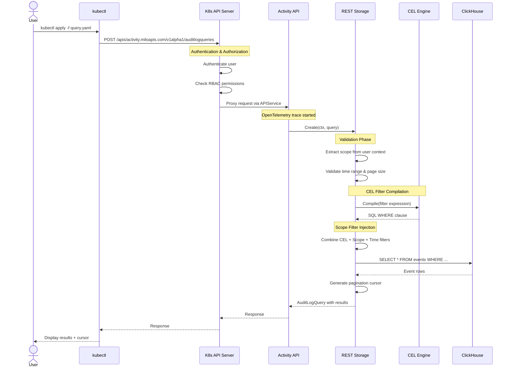

# API Server Architecture

Activity is a [Kubernetes aggregated apiserver][apiserver-aggregation] that
provides [audit log] querying capabilities backed by [ClickHouse].

## Overview

Activity follows the Kubernetes [aggregated API server
pattern][apiserver-aggregation], seamlessly integrating with the Kubernetes API
surface.

**Key Characteristics:**
- **Ephemeral Resources**: `AuditLogQuery` executes immediately and returns
  results without persistence
- **ClickHouse Storage**: High-performance querying of time-series audit data
- **CEL Filtering**: Powerful filtering using [Common Expression Language][cel]
- **Scope-aware**: Multi-tenant query isolation based on user context
- **Observable**: Full [OpenTelemetry] tracing and [Prometheus] metrics
- **Declarative-friendly time ranges**: Supports relative time range queries
  with the `now-30d` syntax

[opentelemetry]: https://opentelemetry.io
[cel]: https://cel.dev
[apiserver-aggregation]:
    https://kubernetes.io/docs/concepts/extend-kubernetes/api-extension/apiserver-aggregation/
[clickhouse]: https://clickhouse.com/docs
[audit log]: https://kubernetes.io/docs/tasks/debug/debug-cluster/audit/
[prometheus]: https://prometheus.io

## Architecture Diagram

```
┌──────────────────────────────────────────────────────────────┐
│                      Kubernetes API Server                   │
│                                                              │
│  ┌────────────────────────────────────────────────────────┐  │
│  │          APIService Registration                       │  │
│  │  activity.miloapis.com/v1alpha1 → activity-apiserver   │  │
│  └────────────────────────────────────────────────────────┘  │
└──────────────────────────────┬───────────────────────────────┘
                               │ Proxied requests for
                               │   activity.miloapis.com
                               ▼
┌──────────────────────────────────────────────────────────────┐
│              Activity API Server (Aggregated)                │
│                                                              │
│  ┌────────────────────────────────────────────────────────┐  │
│  │  HTTP Layer (OpenTelemetry Instrumentation)            │  │
│  └─────────────────────┬──────────────────────────────────┘  │
│                        ▼                                     │
│  ┌────────────────────────────────────────────────────────┐  │
│  │  REST Storage (AuditLogQuery)                          │  │
│  │  - Validation & scope extraction                       │  │
│  └─────────────────────┬──────────────────────────────────┘  │
│                        ▼                                     │
│  ┌────────────────────────────────────────────────────────┐  │
│  │  ClickHouse Storage Layer                              │  │
│  │  - CEL → SQL compilation                               │  │
│  │  - Cursor-based pagination                             │  │
│  └─────────────────────┬──────────────────────────────────┘  │
└────────────────────────┼─────────────────────────────────────┘
                         ▼
              ┌──────────────────┐
              │   ClickHouse     │
              └──────────────────┘
```

## Core Components

### API Server Core

Implements the Kubernetes API server pattern with:
- Audit data queried from ClickHouse
- OpenTelemetry HTTP instrumentation for all requests
- Separate metrics endpoint (`:8080`) from secure API (`:6443`)
- OpenAPI v3 documentation generation

### REST Storage

Handles `AuditLogQuery` resource operations:
- Ephemeral resource (only `Create` implemented)
- Extracts user scope from context
- Validates time ranges (RFC3339 or relative format like "now-7d")
- Validates filters and page sizes
- Converts errors to Kubernetes API errors

### ClickHouse Storage

Manages all ClickHouse interactions:
- Compiles CEL filters to SQL
- Injects scope-based filtering
- Implements cursor-based pagination
- Tracks performance metrics

### CEL Filter Engine

Translates CEL expressions to ClickHouse SQL.

**Supported fields:**
- `auditID`, `verb`, `stage`, `stageTimestamp`
- `objectRef.{namespace,resource,name}`
- `user.username`
- `responseStatus.code`

**Example:**
```cel
verb == 'delete' && objectRef.namespace == 'production'
```

### Scope Management

Multi-tenant query isolation extracted from user context:
- **Platform**: All events
- **Organization**: Organization-scoped events
- **Project**: Project-scoped events

## Request Flow



## Pagination

The API uses cursor-based pagination for efficient, consistent results.

**How it works:**
- API fetches `limit + 1` events to detect if more results exist
- Cursor encodes `(timestamp, auditID)` of the last event
- Next page uses cursor in `spec.continueAfter`
- Empty cursor (`""`) indicates end of results

**Best practices:**
- Complete pagination within 1 hour
- Use identical parameters between pages
- Don't persist cursors

## External References
- [Kubernetes API Conventions][api-conventions]
- [Aggregated API Servers][apiserver-aggregation]
- [Common Expression Language (CEL)][cel]
- [ClickHouse Documentation][clickhouse]

[api-conventions]:
    https://github.com/kubernetes/community/blob/master/contributors/devel/sig-architecture/api-conventions.md
