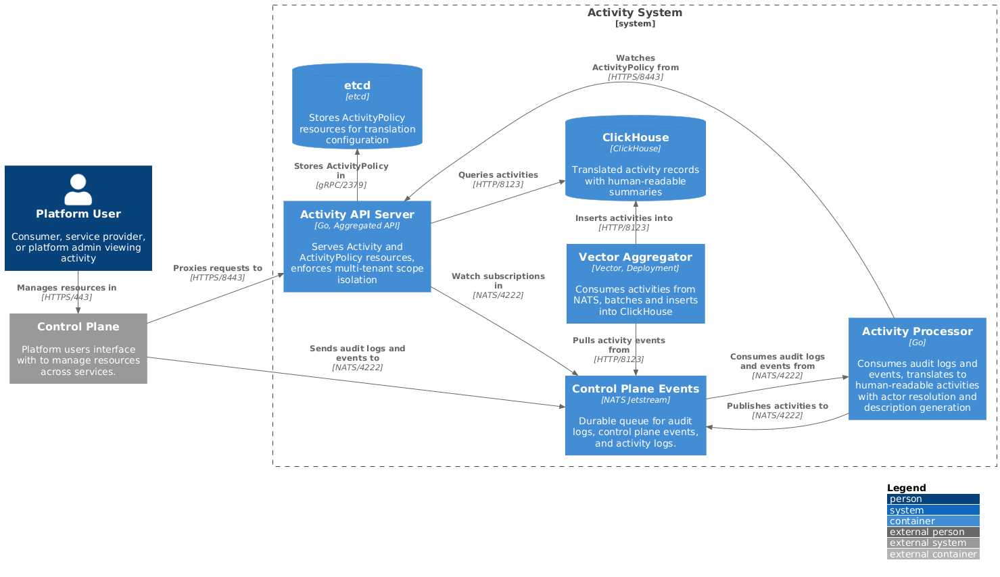
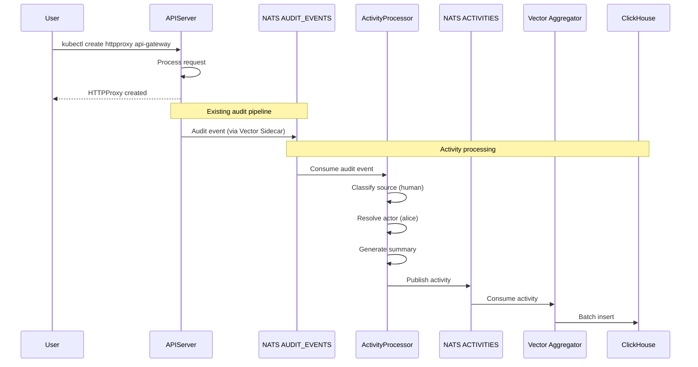
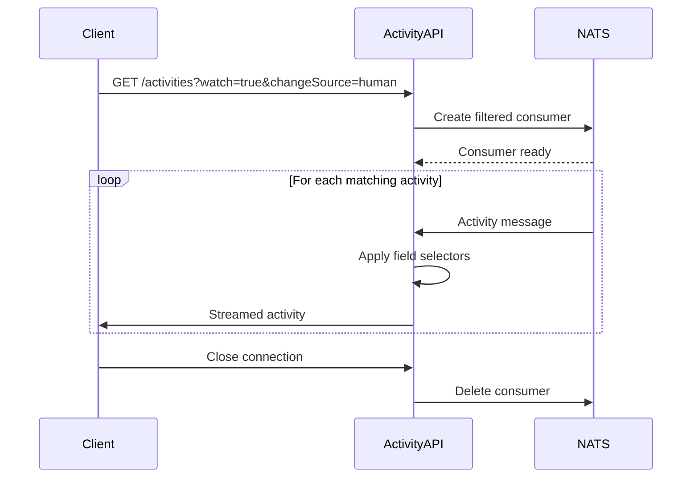

<!-- omit from toc -->
# Activity Stream System

- [Overview](#overview)
  - [Input Sources](#input-sources)
- [Goals](#goals)
- [Non-Goals](#non-goals)
- [Personas](#personas)
  - [Consumer](#consumer)
  - [Service Provider](#service-provider)
  - [Platform Administrator](#platform-administrator)
- [User Experience](#user-experience)
  - [Activity Feed](#activity-feed)
  - [Filtering and Search](#filtering-and-search)
  - [Resource Activity View](#resource-activity-view)
  - [Policy Authoring](#policy-authoring)
- [Architecture](#architecture)
  - [Storage](#storage)
- [API Design](#api-design)
  - [Activity Resource](#activity-resource)
  - [ActivityPolicy Resource](#activitypolicy-resource)
  - [ActivityPolicy Lifecycle](#activitypolicy-lifecycle)
- [Translation Engine](#translation-engine)
  - [Kind Labels](#kind-labels)
  - [ActivityPolicy Requirement](#activitypolicy-requirement)
  - [CEL Expression Variables](#cel-expression-variables)
  - [Link Function](#link-function)
  - [CEL String Functions](#cel-string-functions)
  - [Actor Resolution](#actor-resolution)
- [Change Source Classification](#change-source-classification)
- [Activity API](#activity-api)
  - [Endpoints](#endpoints)
  - [Query Parameters](#query-parameters)
  - [Time Range](#time-range)
  - [CEL Filter](#cel-filter)
  - [Field Selectors](#field-selectors)
  - [Label Selectors](#label-selectors)
  - [Full-Text Search](#full-text-search)
  - [Facet Queries](#facet-queries)
  - [Policy Preview](#policy-preview)
- [NATS Subject Convention](#nats-subject-convention)
  - [Examples](#examples)
  - [Wildcard Subscriptions](#wildcard-subscriptions)
- [Storage](#storage-1)
- [Sequence Diagrams](#sequence-diagrams)
  - [Audit Log to Activity](#audit-log-to-activity)
  - [Activity Watch](#activity-watch)
- [Security](#security)
  - [Data Sensitivity](#data-sensitivity)
- [Future Enhancements](#future-enhancements)
- [References](#references)

## Overview

The activity stream system provides consumers, service providers, and platform
administrators with a unified view of resource changes across the platform. The
system translates raw audit logs and control plane events into human-readable,
semantically meaningful activity records.

Unlike raw audit logs (which capture every API call) or Kubernetes events (which
report controller status), the activity system provides:

- **Descriptive translations** of technical operations into user-friendly
  language
- **Persona-specific views** tailored to consumers, service providers, and
  platform administrators
- **Configurable filtering** by change source (human vs. system-initiated)

### Input Sources

The activity system consumes two distinct input sources from the Kubernetes
control plane:

**Audit Logs** are generated by the Kubernetes API server for every API request.
They capture who made a request, what operation was performed, which resource
was affected, and the request/response bodies. Audit logs are the authoritative
record of all API interactions and are primarily useful for security auditing,
compliance, and debugging. However, they are verbose and technical—a single user
action may generate multiple audit entries, and the format is not user-friendly.

**Kubernetes Events** are created by controllers to report status changes and
noteworthy occurrences during reconciliation. Events indicate things like
"resource is now ready," "configuration was rejected," or "provisioning failed."
Unlike audit logs, events are generated asynchronously by controllers and may
not correspond directly to a user action. Events are useful for understanding
what the system is doing but lack context about who initiated the change.

The activity system combines these sources to produce a unified stream: audit
logs provide the "who" and "what," while events provide the "status" and
"outcome."

## Goals

- Provide a unified activity stream for all Kubernetes resources
- Transform audit logs and events into descriptive activity records with
  human-readable messages
- Support three distinct personas: consumers, service providers, platform
  administrators
- Enable configurable filtering by change source (human, system, or all)
- Support audit/compliance, debugging/troubleshooting, and notification use
  cases
- Maintain multi-tenant isolation with the flat tenant model

## Non-Goals

- Replacing the raw audit log storage (audit logs remain authoritative)
- Replacing the event storage system (events remain available via standard API)
- Real-time alerting (activity records are informational, not actionable alerts)
- Modifying the Kubernetes audit or event schemas

## Personas

The activity system supports three distinct personas with different visibility
requirements and use cases.

| Persona | Scope | Primary Use Cases |
|---------|-------|-------------------|
| Consumer | Project / Organization resources | View changes to owned networking and DNS resources |
| Service Provider | API group | Monitor service usage across tenants, track adoption |
| Platform Administrator | Global | Infrastructure changes, security auditing, incident investigation |

### Consumer

Consumers interact with networking and DNS resources within their projects.
Their activity view focuses on resources within their authorized scope,
emphasizing what changed and when rather than technical details. The view omits
internal system reconciliation noise.

### Service Provider

Service providers own and operate services exposed via API groups (e.g.,
`networking.datumapis.com`, `dns.networking.miloapis.com`). Their activity view
provides cross-tenant visibility scoped to their API group, supporting capacity
planning and feature adoption metrics.

### Platform Administrator

Platform administrators manage the underlying infrastructure with global
visibility across all tenants. Their activity view includes system-level context
such as operator actions and infrastructure provisioning, with security-focused
filtering for policy and configuration changes.

## User Experience

The activity system provides several user-facing interfaces tailored to each
persona's needs. This section describes the expected UX patterns and components.

### Activity Feed

The primary interface is a chronological activity feed that displays translated
activities in real-time. The feed supports the following interactions:

| Feature | Description |
|---------|-------------|
| **Infinite scroll** | Load older activities as the user scrolls down |
| **Real-time updates** | New activities appear at the top via Watch API |
| **Clickable links** | Resource references in summaries link to resource detail pages |
| **Expandable details** | Click an activity to view field-level changes and origin metadata |

The feed uses the `links` array from each activity to make resource references
clickable. When a user clicks a linked marker (e.g., "HTTP proxy api-gateway"),
the portal navigates to that resource's detail page.

### Filtering and Search

Users can filter the activity feed using a combination of controls:

| Control | Purpose |
|---------|---------|
| **Change source toggle** | Switch between human-initiated, system-initiated, or all activities |
| **Time range picker** | Filter activities to a specific time window |
| **Resource type selector** | Multi-select filter by API group and kind |
| **Actor search** | Autocomplete search for activities by a specific actor |
| **Full-text search** | Search activity summaries for keywords |

The change source toggle is prominently displayed since filtering out system
reconciliation noise is a primary use case. Filter selections persist in the URL
for bookmarking and sharing.

Autocomplete fields (actor, resource type) are powered by the `ActivityFacetQuery`
API, which returns distinct values matching the user's input prefix.

### Resource Activity View

Each resource detail page includes an "Activity" tab showing activities scoped
to that specific resource. This view:

- Filters activities to `spec.resource.uid` matching the current resource
- Shows the complete history of changes to the resource
- Includes both human and system activities by default
- Supports the same filtering controls as the main feed

### Policy Authoring

Service providers author ActivityPolicy resources to define how their resources
appear in the activity stream. The policy authoring experience includes:

| Feature | Description |
|---------|-------------|
| **Policy list** | View all ActivityPolicy resources grouped by API group |
| **CEL editor** | Syntax-highlighted editor for match expressions and summary templates |
| **Validation feedback** | Real-time validation via `?dryRun=All` on save |
| **Template preview** | Test policies against sample audit logs or events before deployment |

The template preview feature lets policy authors see exactly what summary would
be generated for a given input without waiting for real traffic. Authors paste
or select a sample audit event, and the preview shows the matched rule and
resulting activity.

## Architecture



*Source: [activity-system.puml](../diagrams/activity-logs.puml)*

### Storage

The activity system uses two storage backends:

| Backend | Purpose | Data |
|---------|---------|------|
| **ClickHouse** | Analytics storage for translated activities | Activity records with human-readable summaries, optimized for time-range queries |
| **etcd** | Configuration storage for ActivityPolicy resources | Translation rules and templates, served by the Activity API Server |

The Activity API Server is an [aggregated API server][aggregated-api] that serves
both resource types under the `activity.miloapis.com` API group. Using a
dedicated etcd instance (separate from the platform's main etcd) provides:

- **Watch support**: The Activity Processor watches for ActivityPolicy changes
  and reloads translation rules without restart
- **Consistent API**: Both `Activity` and `ActivityPolicy` are served by the
  same API server under a single API group
- **Isolation**: ActivityPolicy storage is independent of the platform control
  plane's etcd

[aggregated-api]: https://kubernetes.io/docs/concepts/extend-kubernetes/api-extension/apiserver-aggregation/

## API Design

### Activity Resource

The `Activity` resource (`activity.miloapis.com/v1alpha1`) represents a single
translated activity record exposed via the Kubernetes API for List/Watch/Get
operations.

```yaml
apiVersion: activity.miloapis.com/v1alpha1
kind: Activity
metadata:
  # Unique identifier for this activity record
  name: act-abc123
  # Namespace matches the resource's namespace (or "default" for cluster-scoped)
  namespace: default
  # Labels enable efficient filtering via label selectors
  labels:
    activity.miloapis.com/origin-type: audit
    activity.miloapis.com/change-source: human
spec:
  # Human-readable description generated from ActivityPolicy templates.
  summary: "alice created HTTP proxy api-gateway"

  # Who initiated the change: "human" (user action) or "system" (controller/operator).
  # Used to filter out reconciliation noise from user-initiated changes.
  changeSource: human

  # The actor who performed the action
  actor:
    # Actor type: "user", "machine account", or "controller"
    type: user
    # Display name for the actor
    name: alice@example.com
    # Unique identifier for the actor
    uid: user-12345
    # Email address (populated for user actors when available)
    email: alice@example.com

  # The resource that was affected by this activity
  resource:
    apiGroup: networking.datumapis.com
    apiVersion: v1
    kind: HTTPProxy
    name: api-gateway
    namespace: default
    uid: resource-67890

  # Linkable entities in the summary for portal rendering.
  # The portal scans the summary for each marker string and makes it clickable.
  links:
    - # Text substring in summary that should be linked
      marker: "HTTP proxy api-gateway"
      # The resource to link to when the marker is clicked
      resource:
        apiGroup: networking.datumapis.com
        apiVersion: v1
        kind: HTTPProxy
        name: api-gateway
        namespace: default

  # Tenant scope for multi-tenant isolation
  tenant:
    # Scope level: "global", "organization", "project", or "user"
    type: project
    # Tenant identifier within that scope
    name: prod

  # Field-level changes with old and new values (for update/patch operations).
  #
  # NOTE: This field is future-looking and may not be available in the initial
  # implementation. Populating old values requires resource history lookups
  # which adds complexity. Initial versions may omit this field or only
  # populate the new values.
  changes:
    - field: "spec.virtualhost.fqdn"
      old: "old.example.com"
      new: "new.example.com"

  # Origin of this activity record for correlation to the source.
  origin:
    # Type indicates the source: "audit" (from audit logs) or "event" (from K8s events)
    type: audit
    # Correlation ID for the source record.
    # For audit: the auditID from the audit log entry.
    # For event: the metadata.uid of the Kubernetes Event.
    id: "abc-123-def"
```

### ActivityPolicy Resource

The `ActivityPolicy` resource (`activity.miloapis.com/v1alpha1`) defines
translation rules for a specific resource type. Service providers create one
ActivityPolicy per resource kind to customize activity descriptions without
modifying the Activity Processor.

```yaml
apiVersion: activity.miloapis.com/v1alpha1
kind: ActivityPolicy
metadata:
  # Name should identify the target resource for clarity
  name: networking-httpproxy
spec:
  # The resource this policy applies to. One policy per resource kind.
  resource:
    apiGroup: networking.datumapis.com
    kind: HTTPProxy

  # Rules for translating audit log entries. Evaluated in order; first match wins.
  # The `audit` variable contains the full Kubernetes audit event structure.
  # Convenience variables: kind, kindPlural, actor
  auditRules:
    # CEL expression that determines if this rule applies.
    - match: "audit.verb == 'create'"
      # CEL template for the activity summary. Use {{ }} to embed expressions.
      summary: "{{ actor }} created {{ link(kind + ' ' + audit.objectRef.name, audit.responseObject) }}"

    - match: "audit.verb == 'delete'"
      summary: "{{ actor }} deleted {{ link(kind + ' ' + audit.objectRef.name, audit.responseObject) }}"

    # Match multiple verbs using the `in` operator
    - match: "audit.verb in ['update', 'patch']"
      summary: "{{ actor }} updated {{ link(kind + ' ' + audit.objectRef.name, audit.responseObject) }}"

  # Rules for translating Kubernetes events. Evaluated in order; first match wins.
  # The `event` variable contains the full Kubernetes Event structure.
  # Convenience variables: kind, kindPlural, actor
  eventRules:
    # CEL expression for matching events.
    - match: "event.reason == 'Programmed'"
      summary: "{{ link(kind + ' ' + event.regarding.name, event.regarding) }} is now programmed"

    - match: "event.reason == 'Ready'"
      summary: "{{ link(kind + ' ' + event.regarding.name, event.regarding) }} is ready"

    # Use string functions for pattern matching
    - match: "event.reason.startsWith('Failed')"
      summary: "{{ link(kind + ' ' + event.regarding.name, event.regarding) }} failed: {{ event.message }}"

    # Fallback rule - match: "true" always matches
    - match: "true"
      summary: "{{ link(kind + ' ' + event.regarding.name, event.regarding) }}: {{ event.reason }}"
```

#### Policy with Resource-Specific Fields

Audit rules can access resource-specific fields directly from `audit.responseObject`:

```yaml
apiVersion: activity.miloapis.com/v1alpha1
kind: ActivityPolicy
metadata:
  name: networking-httpproxy-detailed
spec:
  resource:
    apiGroup: networking.datumapis.com
    kind: HTTPProxy

  auditRules:
    # Access spec fields for richer summaries
    - match: "audit.verb == 'create'"
      summary: "{{ actor }} created {{ link(kind + ' ' + audit.objectRef.name, audit.responseObject) }} for {{ audit.responseObject.spec.virtualhost.fqdn }}"

    - match: "audit.verb in ['update', 'patch']"
      summary: "{{ actor }} updated {{ link(kind + ' ' + audit.objectRef.name, audit.responseObject) }}"

  eventRules:
    # Reference related objects in event summaries
    - match: "event.reason == 'Programmed'"
      summary: "{{ link(kind + ' ' + event.regarding.name, event.regarding) }} programmed on {{ link(event.related.kind + ' ' + event.related.name, event.related) }}"

    - match: "true"
      summary: "{{ link(kind + ' ' + event.regarding.name, event.regarding) }}: {{ event.reason }}"
```

#### Policy with Status Condition Filtering

For controllers that don't emit events (like Envoy Gateway), status condition
changes can be detected from audit logs when controllers update the `/status`
subresource:

```yaml
apiVersion: activity.miloapis.com/v1alpha1
kind: ActivityPolicy
metadata:
  name: gateway-api-gateway
spec:
  resource:
    apiGroup: gateway.networking.k8s.io
    kind: Gateway

  auditRules:
    # User CRUD operations (subresource is empty for main resource)
    - match: "audit.verb == 'create' && audit.objectRef.subresource == ''"
      summary: "{{ actor }} created {{ link(kind + ' ' + audit.objectRef.name, audit.responseObject) }}"

    - match: "audit.verb == 'delete' && audit.objectRef.subresource == ''"
      summary: "{{ actor }} deleted {{ link(kind + ' ' + audit.objectRef.name, audit.responseObject) }}"

    - match: "audit.verb in ['update', 'patch'] && audit.objectRef.subresource == ''"
      summary: "{{ actor }} updated {{ link(kind + ' ' + audit.objectRef.name, audit.responseObject) }}"

    # Status condition changes (from controllers updating /status subresource)
    # Use CEL's exists() to check for specific conditions
    - match: >
        audit.objectRef.subresource == 'status' &&
        audit.responseObject.status.conditions.exists(c, c.type == 'Programmed' && c.status == 'True')
      summary: "{{ link(kind + ' ' + audit.objectRef.name, audit.responseObject) }} is now programmed"

    - match: >
        audit.objectRef.subresource == 'status' &&
        audit.responseObject.status.conditions.exists(c, c.type == 'Accepted' && c.status == 'False')
      summary: "{{ link(kind + ' ' + audit.objectRef.name, audit.responseObject) }} configuration rejected: {{ audit.responseObject.status.conditions.filter(c, c.type == 'Accepted')[0].message }}"

    # Fallback for other status updates
    - match: "audit.objectRef.subresource == 'status'"
      summary: "{{ link(kind + ' ' + audit.objectRef.name, audit.responseObject) }} status updated"
```

#### Minimal Policy

A policy with only fallback rules captures all operations for a resource:

```yaml
apiVersion: activity.miloapis.com/v1alpha1
kind: ActivityPolicy
metadata:
  name: networking-network
spec:
  resource:
    apiGroup: networking.datumapis.com
    kind: Network

  # Single fallback rule handles all audit verbs
  auditRules:
    - match: "true"
      summary: "{{ actor }} {{ audit.verb }}d {{ link(kind + ' ' + audit.objectRef.name, audit.responseObject) }}"

  # Single fallback rule handles all events
  eventRules:
    - match: "true"
      summary: "{{ link(kind + ' ' + event.regarding.name, event.regarding) }}: {{ event.reason }}"
```

### ActivityPolicy Lifecycle

ActivityPolicy resources are managed by service providers and stored in the
Activity API Server's dedicated etcd instance.

#### Ownership and Deployment

Service providers are responsible for creating and maintaining ActivityPolicy
resources for their API groups. Policies should be deployed alongside the
service's CRDs and controllers, typically in the same Helm chart or deployment
manifest.

| Responsibility | Owner |
|----------------|-------|
| Create ActivityPolicy | Service provider (at service deployment time) |
| Update ActivityPolicy | Service provider (when adding new event reasons or changing summaries) |
| Delete ActivityPolicy | Service provider (when decommissioning a resource kind) |

#### Runtime Behavior

The Activity Processor watches ActivityPolicy resources and maintains an
in-memory cache of translation rules:

| Event | Behavior |
|-------|----------|
| ActivityPolicy created | Processor loads the policy and begins translating matching audit logs/events |
| ActivityPolicy updated | Processor reloads the policy; new translations use updated rules |
| ActivityPolicy deleted | Processor stops generating activities for the resource kind |

> [!NOTE]
>
> Changes to ActivityPolicy affect only new audit logs and events. Existing
> Activity records in ClickHouse are not re-translated when a policy changes.

#### Validation

The Activity API Server validates ActivityPolicy resources at admission time:

| Validation | Error |
|------------|-------|
| CEL syntax errors in `match` expressions | Rejected with parse error details |
| CEL syntax errors in `summary` templates | Rejected with parse error details |
| Missing required fields (`resource.apiGroup`, `resource.kind`) | Rejected |
| Duplicate policy for same apiGroup/kind | Rejected (one policy per resource kind) |

## Translation Engine

The translation engine converts raw audit logs and events into human-readable
activity records. The system uses **ActivityPolicy** custom resources to define
translation rules for specific resources.

### Kind Labels

Human-readable kind labels are discovered from the resource's CRD rather than
defined in the ActivityPolicy. Service providers annotate their CRDs with
singular and plural forms:

```yaml
apiVersion: apiextensions.k8s.io/v1
kind: CustomResourceDefinition
metadata:
  name: httpproxies.networking.datumapis.com
  annotations:
    activity.miloapis.com/kind-label: "HTTP proxy"
    activity.miloapis.com/kind-label-plural: "HTTP proxies"
```

If no annotation is present but an ActivityPolicy exists for the resource, the
translation engine derives labels from the Kind name by inserting spaces before
capital letters (e.g., "NetworkContext" → "Network Context"). The plural form
defaults to the singular label with "s" appended.

### ActivityPolicy Requirement

Activities are only generated for resources that have a matching ActivityPolicy.
Resources without a policy are silently ignored by the translation engine. This
opt-in approach ensures:

- **No noise**: Internal system resources don't pollute the activity stream
- **Quality control**: Service providers define meaningful summaries for their resources
- **Explicit intent**: Only resources meant for user visibility generate activities

If a policy exists but no rule matches a specific audit log or event, that
input is also ignored. Service providers should include fallback rules
(e.g., `match: "true"`) if they want to capture all operations.

### CEL Expression Variables

Both rule matching (`match`) and summary templates (`summary`) use [CEL][cel]
expressions. Templates use `{{ }}` delimiters to embed CEL expressions within
strings. Different variables are available depending on the rule type.

[cel]: https://cel.dev

#### Audit Rule Variables

Variables available in `auditRules`. The `audit` variable contains the full
[Kubernetes audit event][k8s-audit] structure, allowing direct access to any
audit field.

[k8s-audit]: https://kubernetes.io/docs/reference/config-api/apiserver-audit.v1/#audit-k8s-io-v1-Event

```yaml
# The full Kubernetes audit log entry
audit:
  level: "RequestResponse"
  auditID: "abc-123-def"
  verb: "patch"
  user:
    username: "alice@example.com"
    uid: "user-12345"
    groups:
      - "system:authenticated"
      - "developers"
    extra:
      organization: ["acme-corp"]
  sourceIPs:
    - "192.168.1.100"
  objectRef:
    apiGroup: "gateway.networking.k8s.io"
    apiVersion: "v1"
    resource: "gateways"
    name: "my-gateway"
    namespace: "default"
    subresource: "status"
  requestURI: "/apis/gateway.networking.k8s.io/v1/namespaces/default/gateways/my-gateway/status"
  responseObject:
    apiVersion: "gateway.networking.k8s.io/v1"
    kind: "Gateway"
    metadata:
      name: "my-gateway"
      namespace: "default"
    spec:
      gatewayClassName: "envoy"
    status:
      conditions:
        - type: "Programmed"
          status: "True"
  requestObject: { ... }

# Derived convenience variables
kind: "Gateway"                       # Human-readable kind label (from CRD annotation)
kindPlural: "Gateways"                # Human-readable plural label (from CRD annotation)
actor: "alice@example.com"            # Resolved display name for the actor
```

#### Event Rule Variables

Variables available in `eventRules`. The `event` variable contains the full
[Kubernetes Event][k8s-event] structure.

[k8s-event]: https://kubernetes.io/docs/reference/kubernetes-api/cluster-resources/event-v1/

```yaml
# The full Kubernetes Event object
event:
  metadata:
    name: "my-gateway.17e3a4c8d2b1f5a0"
    namespace: "default"
    uid: "a1b2c3d4-e5f6-7890-abcd-ef1234567890"
  reason: "Programmed"
  message: "Gateway has been programmed"
  type: "Normal"
  regarding:
    apiVersion: "gateway.networking.k8s.io/v1"
    kind: "Gateway"
    name: "my-gateway"
    namespace: "default"
    uid: "resource-67890"
  related:
    apiVersion: "apps/v1"
    kind: "Deployment"
    name: "envoy-proxy"
    namespace: "envoy-gateway-system"
  reportingController: "gateway.envoyproxy.io/gatewayclass-controller"
  reportingInstance: "envoy-gateway-0"
  action: "Reconcile"
  eventTime: "2024-01-15T10:30:00Z"

# Derived convenience variables
kind: "Gateway"                       # Human-readable kind label (from CRD annotation)
kindPlural: "Gateways"                # Human-readable plural label (from CRD annotation)
actor: "envoy-gateway-controller"     # Resolved from event.reportingController
```

> [!NOTE]
>
> The activity system does not look up the full resource object for events to
> avoid impacting control plane performance. Controllers should include any
> context needed for activity summaries in the event's `message` field or
> annotations. For example, if an activity template needs to display a hostname,
> the controller should include it in the event message rather than expecting
> the activity system to fetch it from the resource.

### Link Function

Templates can use the `link()` function to create clickable references in the
portal. The function registers the text as a linkable marker in the activity's
`links` array.

```
link(displayText, resourceRef)
```

| Parameter | Description |
|-----------|-------------|
| `displayText` | Text to display and use as the marker |
| `resourceRef` | Object containing resource metadata for linking |

The `resourceRef` parameter accepts any object with standard Kubernetes metadata
fields (apiVersion, kind, name, namespace). Common values:

| Rule Type | Primary Resource | Related Resource |
|-----------|------------------|------------------|
| Audit | `audit.responseObject` | N/A |
| Event | `event.regarding` | `event.related` |

Example: `{{ link(kind + " " + audit.objectRef.name, audit.responseObject) }}`
produces "HTTP proxy api-gateway" in the summary and adds it to the `links` array.

### CEL String Functions

CEL expressions can use built-in string functions:

| Function | Example | Result |
|----------|---------|--------|
| Conditional | `{{ size(audit.objectRef.name) > 20 ? audit.objectRef.name.substring(0, 17) + "..." : audit.objectRef.name }}` | Truncated name |
| `contains()` | `{{ event.reason.contains("Failed") ? "failed" : "succeeded" }}` | "failed" or "succeeded" |
| `startsWith()` | `{{ audit.objectRef.name.startsWith("prod-") ? "production " + kind : kind }}` | Prefixed kind |
| `in` | `audit.verb in ['update', 'patch']` | true if verb is update or patch |

### Actor Resolution

The translation engine resolves actors from different sources based on the
activity origin:

| Source | Resolution Method |
|--------|-------------------|
| Audit logs | Extract from `audit.user.username`, `audit.user.uid`, and `audit.user.extra` fields |
| Events with actor annotations | Use `activity.miloapis.com/actor-*` annotations |
| Events from controllers | Map `event.reportingController` to a system actor |
| Unknown | Default to "system" actor |

Actors are classified into three types:

| Type | Description | Example |
|------|-------------|---------|
| `user` | Human users authenticated via OIDC or other providers | `alice@example.com` |
| `machine account` | Kubernetes service accounts | `system:machine account:default:my-sa` |
| `controller` | Kubernetes controllers and operators | `deployment-controller` |

## Change Source Classification

Activities are classified by their change source to enable filtering of human
actions from system reconciliation.

| Classification | Examples |
|----------------|----------|
| Human | User actions via kubectl, API, or UI; service accounts with `initiated-by: user` annotation |
| System | Controller reconciliation, operator actions, scheduled jobs, autoscaling, garbage collection |

The Activity Processor applies classification rules in order:

| Priority | Rule | Result |
|----------|------|--------|
| 1 | Explicit `activity.miloapis.com/change-source` annotation | Annotation value |
| 2 | Username matches `system:machine account:kube-system:*` | System |
| 3 | Username matches `system:*` | System |
| 4 | Audit-sourced with non-system username | Human |
| 5 | Event-sourced activity | System |
| 6 | No match | Unknown |

> [!NOTE]
>
> Event-sourced activities default to system-initiated because events are
> typically generated by controllers. To mark an event as human-initiated, the
> originating controller must set the `activity.miloapis.com/change-source:
> human` annotation on the event.

## Activity API

The activity API server exposes activity queries through the control plane API.
It uses the [Kubernetes aggregated apiserver framework][aggregated-api] to
integrate seamlessly with kubectl and standard Kubernetes clients.

[aggregated-api]:
    https://kubernetes.io/docs/concepts/extend-kubernetes/api-extension/apiserver-aggregation/

The API server delegates authentication and authorization to the core platform
API server. Query scope is determined by the user's authentication context,
extracted from extra fields set by the platform's identity system.

### Endpoints

| Method | Path | Description |
|--------|------|-------------|
| GET | `/apis/activity.miloapis.com/v1/activities` | List activities (scoped by authorization) |
| GET | `/apis/activity.miloapis.com/v1/namespaces/{ns}/activities` | List activities in namespace |
| GET | `/apis/activity.miloapis.com/v1/namespaces/{ns}/activities/{name}` | Get specific activity |
| GET | `/apis/activity.miloapis.com/v1/activities?watch=true` | Watch for new activities |
| POST | `/apis/activity.miloapis.com/v1/activityfacetqueries` | Query distinct field values for filtering |
| POST | `/apis/activity.miloapis.com/v1/activitypolicies/{name}/preview` | Preview policy output |

### Query Parameters

| Parameter | Type | Description |
|-----------|------|-------------|
| `filter` | string | CEL expression to filter activities |
| `fieldSelector` | string | Filter by field values (Kubernetes standard) |
| `labelSelector` | string | Filter by labels |
| `search` | string | Full-text search on activity summaries (List only) |
| `start` | string | Start of time range (RFC3339 or relative) |
| `end` | string | End of time range (RFC3339 or relative, default: now) |
| `resourceVersion` | string | Start Watch from this version |
| `limit` | int | Maximum results (1-1000, default 100) |
| `continue` | string | Pagination cursor |

> [!NOTE]
>
> The `search` parameter is only supported for List operations. Watch requests
> with a `search` parameter return an error. Use `filter`, `fieldSelector`, or
> `labelSelector` for filtering Watch streams.

### Time Range

The `start` and `end` parameters filter activities by creation time. Both
parameters accept either RFC3339 timestamps or relative time expressions.

**Relative time format:** `now[-+]<duration>` where duration uses suffixes:
- `s` - seconds
- `m` - minutes
- `h` - hours
- `d` - days
- `w` - weeks

Examples:

```
# Activities from the last 24 hours
start=now-24h

# Activities from the last 7 days
start=now-7d

# Activities from a specific time range
start=2024-01-01T00:00:00Z&end=2024-01-02T00:00:00Z

# Activities from 4 days ago to 2 days ago
start=now-4d&end=now-2d
```

If `start` is omitted, no lower bound is applied (queries from the beginning of
retained data). If `end` is omitted, it defaults to `now`.

### CEL Filter

The `filter` parameter accepts a CEL expression for flexible activity filtering.
This is the recommended approach for complex queries and is consistent with the
filtering used in `ActivityFacetQuery` and `ActivityAggregationQuery`.

```
# Filter human-initiated activities for a specific API group
filter=spec.changeSource == 'human' && spec.resource.apiGroup == 'networking.datumapis.com'

# Filter by actor name prefix (for autocomplete)
filter=spec.actor.name.startsWith('alice')

# Filter by multiple resource kinds
filter=spec.resource.kind in ['HTTPProxy', 'Gateway', 'Network']

# Filter by actor type
filter=spec.actor.type == 'user'
```

The CEL expression has access to all fields in the Activity resource. Common
fields for filtering:

| Field | Type | Description |
|-------|------|-------------|
| `spec.changeSource` | string | `"human"` or `"system"` |
| `spec.actor.name` | string | Actor display name |
| `spec.actor.type` | string | `"user"`, `"machine account"`, or `"controller"` |
| `spec.resource.apiGroup` | string | Resource API group |
| `spec.resource.kind` | string | Resource kind |
| `spec.resource.name` | string | Resource name |
| `spec.resource.namespace` | string | Resource namespace |
| `spec.origin.type` | string | `"audit"` or `"event"` |

### Field Selectors

```
# Filter by API group (for service providers)
fieldSelector=spec.resource.apiGroup=networking.datumapis.com
fieldSelector=spec.resource.apiGroup=dns.networking.miloapis.com

# Filter by change source
fieldSelector=spec.changeSource=human
fieldSelector=spec.changeSource=system

# Filter by resource kind
fieldSelector=spec.resource.kind=HTTPProxy

# Filter by actor
fieldSelector=spec.actor.name=alice

# Filter by origin type
fieldSelector=spec.origin.type=audit
fieldSelector=spec.origin.type=event

# Combined filters (service provider viewing human changes to their service)
fieldSelector=spec.resource.apiGroup=networking.datumapis.com,spec.changeSource=human
```

### Label Selectors

```
# Filter by origin type
labelSelector=activity.miloapis.com/origin-type=audit

# Filter by change source
labelSelector=activity.miloapis.com/change-source=human
```

### Full-Text Search

The `search` parameter performs tokenized full-text search on activity
summaries. The search uses ClickHouse's `tokenbf_v1` bloom filter index for
efficient matching.

```
# Search for activities mentioning "HTTPProxy"
search=HTTPProxy

# Search for activities involving a specific resource name
search=api-gateway

# Search for delete operations
search=deleted
```

Search terms are tokenized and matched against the `summary` field. Multiple
words are treated as an AND query—all terms must appear in the summary. The
search is case-insensitive.

| Search Query | Matches |
|--------------|---------|
| `HTTPProxy` | "alice created HTTPProxy api-gateway" |
| `alice HTTPProxy` | "alice created HTTPProxy api-gateway" |
| `deleted Network` | "bob deleted Network prod-vpc" |

### Facet Queries

The `ActivityFacetQuery` resource is an ephemeral query that returns distinct
values for one or more fields, supporting autocomplete and filter population in
the UI. Create the query via POST, and results are returned in the status field
of the response. The resource is not persisted.

```
POST /apis/activity.miloapis.com/v1/activityfacetqueries
```

Request:

```json
{
  "kind": "ActivityFacetQuery",
  "apiVersion": "activity.miloapis.com/v1",
  "spec": {
    "timeRange": {
      "start": "now-7d"
    },
    "filter": "spec.changeSource == 'human' && spec.resource.apiGroup == 'networking.datumapis.com'",
    "facets": [
      {"field": "spec.actor.name", "limit": 10},
      {"field": "spec.resource.kind", "limit": 20},
      {"field": "spec.resource.apiGroup"}
    ]
  }
}
```

| Spec Field | Type | Description |
|------------|------|-------------|
| `timeRange.start` | string | Start of time range (RFC3339 or relative, optional) |
| `timeRange.end` | string | End of time range (RFC3339 or relative, default: now) |
| `filter` | string | CEL expression to filter activities before computing facets (optional) |
| `facets` | []FacetSpec | List of facets to query (required, 1-10 facets) |
| `facets[].field` | string | Field path to get distinct values for (required) |
| `facets[].limit` | int | Maximum values to return (1-100, default 20) |

Time range values support the same format as the Activity list API: RFC3339
timestamps or relative expressions like `now-24h`, `now-7d`.

The `filter` expression is evaluated against each activity record. Only activities
matching the filter are included when computing facet values and counts. This
ensures facet results reflect the current view's filter state.

For autocomplete scenarios where you need to filter facet values by a prefix,
include the prefix condition in the filter:

```json
{
  "spec": {
    "filter": "spec.actor.name.startsWith('ali')",
    "facets": [{"field": "spec.actor.name", "limit": 10}]
  }
}
```

Supported fields for faceting:

| Field | Description |
|-------|-------------|
| `spec.actor.name` | Actor names for autocomplete |
| `spec.resource.apiGroup` | API groups for filtering |
| `spec.resource.kind` | Resource kinds for filtering |
| `spec.resource.namespace` | Namespaces for filtering |

Response:

```json
{
  "kind": "ActivityFacetQuery",
  "apiVersion": "activity.miloapis.com/v1",
  "spec": {
    "timeRange": {
      "start": "now-7d"
    },
    "filter": "spec.changeSource == 'human' && spec.resource.apiGroup == 'networking.datumapis.com'",
    "facets": [
      {"field": "spec.actor.name", "limit": 10},
      {"field": "spec.resource.kind", "limit": 20},
      {"field": "spec.resource.apiGroup"}
    ]
  },
  "status": {
    "facets": [
      {
        "field": "spec.actor.name",
        "values": [
          {"value": "alice@example.com", "count": 142},
          {"value": "alice-bot@system", "count": 87}
        ]
      },
      {
        "field": "spec.resource.kind",
        "values": [
          {"value": "HTTPProxy", "count": 523},
          {"value": "Gateway", "count": 412},
          {"value": "Network", "count": 203}
        ]
      },
      {
        "field": "spec.resource.apiGroup",
        "values": [
          {"value": "networking.datumapis.com", "count": 726},
          {"value": "gateway.networking.k8s.io", "count": 412}
        ]
      }
    ]
  }
}
```

### Policy Preview

The policy preview endpoint tests an ActivityPolicy against a sample audit log
or event, returning what activity would be generated. This supports policy
authoring workflows without requiring real traffic.

```
POST /apis/activity.miloapis.com/v1/activitypolicies/{name}/preview
```

Request body:

```json
{
  "auditEvent": {
    "level": "RequestResponse",
    "auditID": "test-123",
    "verb": "create",
    "user": {
      "username": "alice@example.com",
      "uid": "user-12345"
    },
    "objectRef": {
      "apiGroup": "networking.datumapis.com",
      "apiVersion": "v1",
      "resource": "httpproxies",
      "name": "api-gateway",
      "namespace": "default"
    },
    "responseObject": {
      "apiVersion": "networking.datumapis.com/v1",
      "kind": "HTTPProxy",
      "metadata": {
        "name": "api-gateway",
        "namespace": "default"
      },
      "spec": {
        "virtualhost": {
          "fqdn": "api.example.com"
        }
      }
    }
  }
}
```

For event-based preview, use `event` instead of `auditEvent`:

```json
{
  "event": {
    "reason": "Programmed",
    "message": "HTTPProxy has been programmed",
    "regarding": {
      "apiVersion": "networking.datumapis.com/v1",
      "kind": "HTTPProxy",
      "name": "api-gateway",
      "namespace": "default"
    }
  }
}
```

Response:

```json
{
  "kind": "ActivityPolicyPreview",
  "apiVersion": "activity.miloapis.com/v1",
  "matched": true,
  "matchedRule": {
    "index": 0,
    "type": "audit",
    "match": "audit.verb == 'create'"
  },
  "activity": {
    "summary": "alice@example.com created HTTP proxy api-gateway",
    "changeSource": "human",
    "actor": {
      "type": "user",
      "name": "alice@example.com",
      "uid": "user-12345"
    },
    "links": [
      {
        "marker": "HTTP proxy api-gateway",
        "resource": {
          "apiGroup": "networking.datumapis.com",
          "apiVersion": "v1",
          "kind": "HTTPProxy",
          "name": "api-gateway",
          "namespace": "default"
        }
      }
    ]
  }
}
```

If no rule matches, the response indicates this:

```json
{
  "kind": "ActivityPolicyPreview",
  "apiVersion": "activity.miloapis.com/v1",
  "matched": false,
  "matchedRule": null,
  "activity": null
}
```

## NATS Subject Convention

Activities are published to subjects that support filtering by tenant, API
group, and resource:

```
activities.<tenant_type>.<tenant_name>.<api_group>.<source>.<resource_kind>.<namespace>.<resource_name>
```

The API group is included to enable service providers to subscribe to all
activities for their service. Dots in API groups are replaced with underscores
(e.g., `networking.datumapis.com` becomes `networking_datumapis_com`).

### Examples

| Activity | Subject |
|----------|---------|
| User created HTTPProxy | `activities.project.prod.networking_datumapis_com.audit.HTTPProxy.default.api-gateway` |
| Network programmed event | `activities.project.prod.networking_datumapis_com.event.Network.default.prod-network` |
| DNSZone created | `activities.project.prod.dns_networking_miloapis_com.audit.DNSZone.default.example-com` |
| Cluster-scoped Location | `activities.global._.networking_datumapis_com.audit.Location._.gcp-us-central1` |

### Wildcard Subscriptions

| Pattern | Use Case |
|---------|----------|
| `activities.project.prod.>` | Consumer: all activities in prod project |
| `activities.*.*.networking_datumapis_com.>` | Service provider: all networking service activities |
| `activities.*.*.dns_networking_miloapis_com.>` | Service provider: all DNS service activities |
| `activities.*.*.*.audit.>` | All audit-sourced activities |
| `activities.*.*.*.*.HTTPProxy.>` | All HTTPProxy activities across tenants |

## Storage

The activity system stores translated activities in a ClickHouse cluster managed
by the [Altinity ClickHouse Operator][clickhouse-operator]. The cluster uses the
same deployment topology as the audit storage system.

[clickhouse-operator]: https://github.com/Altinity/clickhouse-operator

The `activity.activities` table stores activity records with materialized
columns extracted for efficient filtering:

| Column | Type | Purpose |
|--------|------|---------|
| `activity_json` | String | Full activity record (ZSTD compressed) |
| `timestamp` | DateTime64 | Activity creation time |
| `tenant_type` | LowCardinality(String) | Tenant type (global, organization, project, user) |
| `tenant_name` | String | Tenant identifier |
| `origin_type` | LowCardinality(String) | Origin: audit or event |
| `origin_id` | String | Correlation ID to source record |
| `change_source` | LowCardinality(String) | Initiator: human or system |
| `actor_type` | LowCardinality(String) | Actor type (user, machine account, controller) |
| `actor_name` | String | Actor identifier |
| `actor_uid` | String | Actor unique identifier |
| `api_group` | LowCardinality(String) | Resource API group |
| `resource_kind` | LowCardinality(String) | Resource kind |
| `resource_name` | String | Resource name |
| `resource_namespace` | String | Resource namespace |
| `resource_uid` | String | Resource UID |
| `summary` | String | Human-readable summary |

The table uses `ReplicatedReplacingMergeTree` with daily partitioning and a
primary key optimized for tenant-scoped time range queries. The primary key
ordering is `(tenant_type, tenant_name, timestamp, resource_uid)`.

| Index | Type | Columns | Purpose |
|-------|------|---------|---------|
| `idx_api_group` | bloom_filter | `api_group` | Service provider queries |
| `idx_actor` | bloom_filter | `actor_name` | Actor-based filtering |
| `idx_resource` | bloom_filter | `resource_kind, resource_name` | Resource lookups |
| `idx_change_source` | minmax | `change_source` | Human vs system filtering |
| `idx_summary_search` | tokenbf_v1 | `summary` | Full-text search on activity summaries |

The cluster uses local SSD storage with 30-day retention:

| Setting | Value | Purpose |
|---------|-------|---------|
| Storage | Local SSD | Fast queries on recent data |
| Retention | 30 days | TTL-based automatic deletion |

## Sequence Diagrams

### Audit Log to Activity



### Activity Watch



## Security

The activity system inherits authorization from the underlying resource system.
Users can only view activities for resources they have `get` permission on.
Platform administrators require explicit cluster-wide activity permissions.

> [!IMPORTANT]
>
> The platform is responsible for authorizing users before they reach the
> activity API. The activity service trusts the scope provided by the
> authentication system and does not perform additional authorization checks.

### Data Sensitivity

The Activity Processor filters sensitive data before creating activity records:

| Data Type | Handling |
|-----------|----------|
| Secret values | Never included in activity records |
| Actor email addresses | Included only for authorized viewers |
| Change diffs | Exclude sensitive fields (passwords, tokens, keys) |
| Request/response bodies | Redacted based on audit policy |

Activity deletion follows retention policies and cannot be performed manually.
Activity processing operations are themselves audited through the standard audit
pipeline.

## Future Enhancements

| Enhancement | Description |
|-------------|-------------|
| Notification integration | Push activities to external systems (Slack, email, webhooks) |
| Custom activity types | Operator-defined activity patterns via CRDs |
| Activity annotations | User-provided context and tags on activities |
| Diff visualization | Rich rendering of configuration changes |
| State reconstruction | Replay activity stream to reconstruct resource state at a point in time |

## References

- [Kubernetes Auditing](https://kubernetes.io/docs/tasks/debug/debug-cluster/audit/)
- [Kubernetes Events](https://kubernetes.io/docs/reference/kubernetes-api/cluster-resources/event-v1/)
- [Event Storage Enhancement](./events.md)
- [NATS JetStream](https://docs.nats.io/nats-concepts/jetstream)
- [ClickHouse](https://clickhouse.com/docs)
