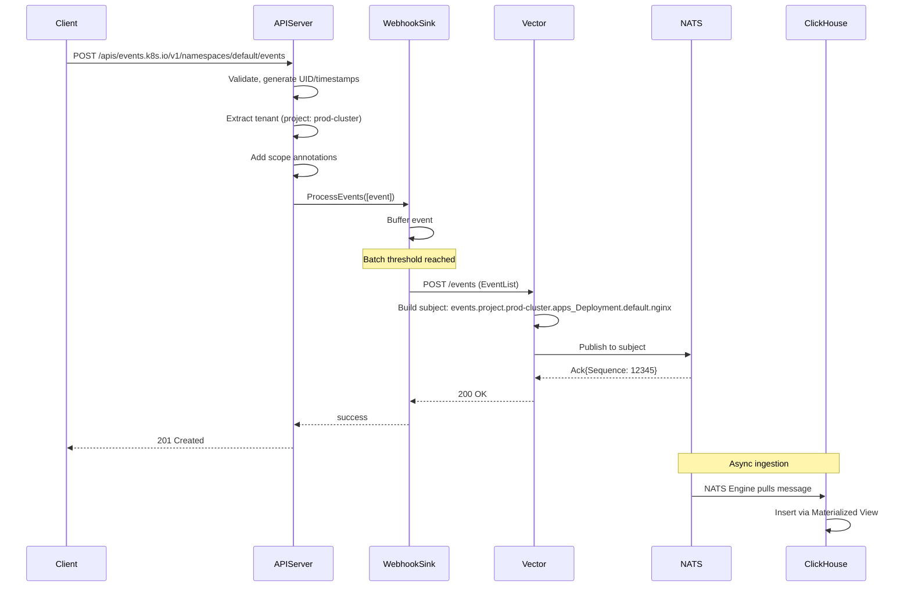
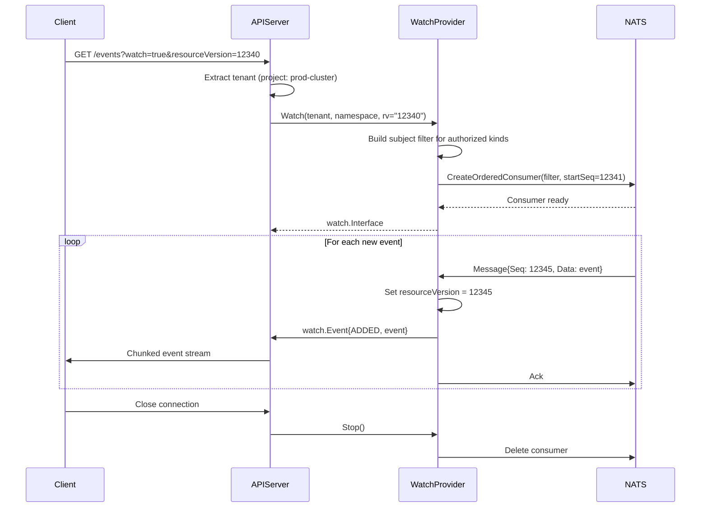
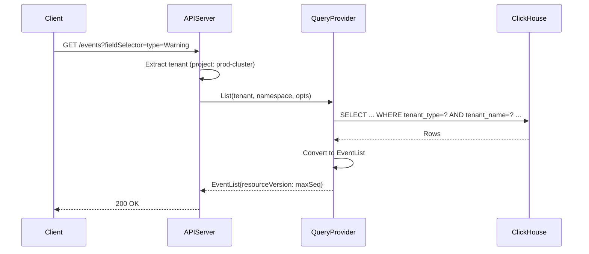

# Event Storage with Webhook Ingestion and NATS Streaming

## Overview

This enhancement proposes replacing the default etcd-based storage for
Kubernetes Event resources with a custom storage backend that uses:

1. **Webhook** for event ingestion (batched writes to an external processor)
2. **NATS JetStream** for real-time event streaming (Watch support)
3. **ClickHouse** for durable, queryable long-term storage

This architecture decouples the API server from specific storage technologies,
allowing the webhook receiver to route events to any combination of backends
while providing real-time Watch support via direct NATS consumer connections.

### Why Replace etcd for Events?

Kubernetes Events present unique challenges for etcd-based storage:

- **High write volume**: Events account for the majority of etcd writes
- **Short retention**: Default 1-hour TTL limits historical analysis
- **No analytics**: etcd doesn't support complex queries or aggregations
- **Scaling issues**: Event storms can destabilize the control plane

By routing events through a webhook to NATS and ClickHouse, Milo can provide:

- Long-term event retention with configurable TTL per tenant
- Rich analytics capabilities for platform operators and tenants
- Real-time event streaming without etcd Watch overhead
- Horizontal scaling independent of the control plane

## Goals

- Replace etcd storage for `events.k8s.io/v1` Event resources entirely
- Use a webhook-based ingestion pattern (similar to audit logging)
- Batch events for efficient delivery to the webhook endpoint
- Support real-time Watch via direct NATS JetStream consumer connections
- Use ClickHouse for List/Get queries and long-term storage
- Maintain full compatibility with the Kubernetes Events API
- Support multi-tenant isolation with flat tenant model (no hierarchy
  inheritance)

## Non-Goals

- Replacing storage for other Kubernetes resources (only Events)
- Modifying the Event API schema or adding custom fields
- Implementing a custom audit sink (audit logging remains separate)
- Providing webhook receiver implementation (Vector or custom service)
- Hierarchical tenant inheritance (organization does not imply project access)

## Architecture

### Data Flow

```
┌─────────────────────────────────────────────────────────────────────────────┐
│                              API Server                                      │
│                                                                             │
│  ┌───────────────────────────────────────────────────────────────────────┐ │
│  │                    Event RESTStorageProvider                          │ │
│  │                                                                       │ │
│  │  Create() ──▶ Webhook Backend ──▶ POST /events (batched EventList)   │ │
│  │                                                                       │ │
│  │  Watch()  ◀── NATS Consumer (direct JetStream connection)            │ │
│  │                                                                       │ │
│  │  List()   ◀── ClickHouse Query                                       │ │
│  │  Get()    ◀── ClickHouse Query                                       │ │
│  └───────────────────────────────────────────────────────────────────────┘ │
└─────────────────────────────────────────────────────────────────────────────┘
              │                                              ▲
              │ HTTP POST                                    │ NATS Subscribe
              ▼                                              │
┌─────────────────────────────────────────────────────────────────────────────┐
│                    Webhook Receiver (Vector / Custom)                       │
│                                                                             │
│  HTTP Source ──▶ Transform ──▶ NATS JetStream Sink ──────────────────────┐ │
│    :8082              │                                                   │ │
│                       └──▶ (Optional: Direct ClickHouse, Kafka, S3)      │ │
└───────────────────────────────────────────────────────────────────────────│─┘
                                                                            │
              ┌─────────────────────────────────────────────────────────────┘
              │
              ▼
┌─────────────────────────────────────────────────────────────────────────────┐
│                         NATS JetStream Cluster                              │
│                                                                             │
│  Stream: MILO_EVENTS                                                        │
│  Subjects: events.<tenant_type>.<tenant_name>.<api_group_kind>.<namespace>.<name>    │
│                                                                             │
│  Consumers:                                                                 │
│  - clickhouse-ingest (durable pull) ──▶ ClickHouse                        │
│  - apiserver-watch-* (ephemeral ordered) ──▶ Watch clients                │
└─────────────────────────────────────────────────────────────────────────────┘
              │
              ▼
┌─────────────────────────────────────────────────────────────────────────────┐
│                              ClickHouse                                      │
│                                                                             │
│  events_queue (NATS Engine) ──▶ events (MergeTree via Materialized View)  │
│                                                                             │
│  - Partitioned by (tenant_type, tenant_name, month)                        │
│  - Ordered by (namespace, involved_kind, name)                             │
│  - TTL: Configurable (default 90 days)                                     │
└─────────────────────────────────────────────────────────────────────────────┘
```

### Component Responsibilities

| Component | Responsibility |
|-----------|----------------|
| Event RESTStorageProvider | Custom `rest.Storage` implementation for Events |
| Webhook Backend | Batches events, sends to webhook with retry/backoff |
| Webhook Receiver | Receives EventList, publishes individual events to NATS |
| NATS JetStream | Event stream with sequence numbers for resourceVersion |
| NATS Watch Consumer | Direct connection from API server for Watch support |
| ClickHouse | Durable storage, List/Get queries, analytics |

### Tenant Model

The system uses a **flat tenant model** with four tenant types. There is no
hierarchical inheritance between tenant types - each operates independently.

| Tenant Type | Description | Example |
|-------------|-------------|---------|
| `global` | Platform-wide, no specific tenant | Cluster-scoped resources |
| `organization` | Organization-scoped events | Org-level settings, memberships |
| `project` | Project-scoped events | Workloads, deployments |
| `user` | User-scoped events | Personal resources, sessions |

This aligns with the scope types defined in `pkg/server/filters/audit_scope.go`.

### Write Path

1. Client creates Event via Kubernetes API
2. RESTStorageProvider validates and enriches Event (UID, timestamps)
3. Webhook Backend buffers Event in memory
4. When batch threshold reached (size or time), POST EventList to webhook
5. Webhook receiver determines tenant context and publishes to NATS subject
6. NATS assigns sequence number (becomes resourceVersion)
7. ClickHouse NATS consumer ingests Event to MergeTree table
8. API server receives acknowledgment, returns Event with resourceVersion

### Watch Path

1. Client requests Watch via Kubernetes API
2. RESTStorageProvider creates NATS ordered consumer
3. Consumer subscribes to filtered subjects based on tenant context
4. Consumer starts from requested resourceVersion (NATS sequence)
5. Events streamed directly from NATS to client
6. Consumer cleaned up when Watch closes

### Query Path (List/Get)

1. Client requests List or Get via Kubernetes API
2. RESTStorageProvider queries ClickHouse with tenant filter
3. Results converted to EventList with resourceVersion from max sequence
4. Response returned to client

## NATS Subject Convention

Events are published to subjects using a flat tenant model:

```
events.<tenant_type>.<tenant_name>.<api_group_kind>.<namespace>.<involved_name>
```

The kind is fully qualified with the API group using `_` as a separator. Dots in
API groups are also replaced with underscores (e.g., `networking.k8s.io` becomes
`networking_k8s_io`). The core API group uses `core` as the group name.

### Tenant Types

- `global` - Platform-wide events (use `_` as tenant_name placeholder)
- `organization` - Organization-scoped events
- `project` - Project-scoped events
- `user` - User-scoped events

### Examples

| Scope | Subject |
|-------|---------|
| Project workload | `events.project.prod-cluster.apps_Deployment.default.nginx` |
| Organization setting | `events.organization.acme-corp.platform_miloapis_com_OrganizationMembership._.alice` |
| User session | `events.user.alice.auth_miloapis_com_Session._.sess-12345` |
| Global/cluster | `events.global._.core_Node._.worker-1` |
| Project pod | `events.project.staging.core_Pod.kube-system.coredns-5644d7b6d9-xyz` |
| Network policy | `events.project.prod-cluster.networking_k8s_io_NetworkPolicy.default.deny-all` |

### Wildcard Subscriptions

| Pattern | Matches |
|---------|---------|
| `events.project.prod-cluster.>` | All events in prod-cluster project |
| `events.organization.acme-corp.>` | All events for acme-corp organization |
| `events.user.alice.>` | All events for user alice |
| `events.global.>` | All global/platform events |
| `events.project.prod-cluster.core_Pod.>` | All Pod events in prod-cluster project |
| `events.project.prod-cluster.core_Pod.default.>` | All Pod events in default namespace |
| `events.project.*.apps_Deployment.>` | All Deployment events across projects |

## Webhook Payload Format

The webhook receives batched events as an EventList with tenant context in
annotations:

```json
{
  "apiVersion": "events.k8s.io/v1",
  "kind": "EventList",
  "items": [
    {
      "apiVersion": "events.k8s.io/v1",
      "kind": "Event",
      "metadata": {
        "name": "nginx-7d4f8b9c5.17a2b3c4d5e6f7a8",
        "namespace": "default",
        "uid": "550e8400-e29b-41d4-a716-446655440000",
        "creationTimestamp": "2024-01-15T10:30:00Z",
        "annotations": {
          "platform.miloapis.com/scope.type": "project",
          "platform.miloapis.com/scope.name": "prod-cluster"
        }
      },
      "eventTime": "2024-01-15T10:30:00.000000Z",
      "reportingController": "deployment-controller",
      "reason": "ScalingReplicaSet",
      "regarding": {
        "apiVersion": "apps/v1",
        "kind": "Deployment",
        "name": "nginx",
        "namespace": "default"
      },
      "note": "Scaled up replica set nginx-7d4f8b9c5 to 3",
      "type": "Normal"
    }
  ]
}
```

## resourceVersion Strategy

NATS JetStream sequence numbers serve as resourceVersion:

- Globally ordered within the stream
- Monotonically increasing
- Assigned by NATS on publish acknowledgment
- Enables efficient Watch resumption

## Configuration

### API Server Flags

```
# Webhook configuration
--event-webhook-config-file=/etc/kubernetes/config/event-webhook-config.yaml
--event-webhook-mode=batch
--event-webhook-batch-buffer-size=10000
--event-webhook-batch-max-size=400
--event-webhook-batch-max-wait=30s
--event-webhook-batch-throttle-qps=10
--event-webhook-initial-backoff=10s

# NATS configuration (for Watch)
--event-nats-urls=nats://nats.milo-system:4222
--event-nats-stream=MILO_EVENTS

# ClickHouse configuration (for List/Get)
--event-clickhouse-addr=clickhouse.milo-system:9000
--event-clickhouse-database=milo
```

### Webhook Configuration File

Uses the same kubeconfig-style format as audit webhooks:

```yaml
# /etc/kubernetes/config/event-webhook-config.yaml
apiVersion: v1
kind: Config
clusters:
- name: event-processor
  cluster:
    server: http://vector-event-processor.milo-system:8082/
contexts:
- context:
    cluster: event-processor
  name: default
current-context: default
```

## Webhook Receiver Configuration (Vector)

```yaml
# vector-event-processor-config.yaml
data_dir: /var/lib/vector

sources:
  event_webhook:
    type: http_server
    address: 0.0.0.0:8082
    path: /
    decoding:
      codec: json

transforms:
  event_processor:
    type: remap
    inputs: [event_webhook]
    drop_on_error: true
    source: |
      # Validate EventList structure
      if !is_array(.items) {
        log("Invalid payload: missing items array", level: "error")
        abort
      }

      events = []

      for_each(array!(.items)) -> |_idx, item| {
        event = object!(item)

        # Extract tenant context from annotations
        annotations = object!(event.metadata.annotations) ?? {}

        tenant_type = annotations."platform.miloapis.com/scope.type" ?? "global"
        tenant_name = annotations."platform.miloapis.com/scope.name" ?? "_"

        # Use placeholder for empty tenant name
        if tenant_name == "" {
          tenant_name = "_"
        }

        event._tenant_type = tenant_type
        event._tenant_name = tenant_name

        # Build NATS subject (kind before namespace for kind-scoped authz)
        regarding = object!(event.regarding) ?? {}
        api_version = regarding.apiVersion ?? "v1"
        kind = regarding.kind ?? "Unknown"
        namespace = event.metadata.namespace ?? "_"
        name = regarding.name ?? "unknown"

        # Extract API group from apiVersion (e.g., "apps/v1" -> "apps", "v1" -> "core")
        api_group = if contains(api_version, "/") {
          split(api_version, "/")[0] ?? "core"
        } else {
          "core"
        }

        # Replace dots with underscores in API group (NATS uses . as delimiter)
        api_group = replace(api_group, ".", "_")

        # Combine group and kind with _ separator
        qualified_kind = join!([api_group, kind], "_")

        event._nats_subject = join!([
          "events",
          tenant_type,
          tenant_name,
          qualified_kind,
          namespace,
          name
        ], ".")

        events = push(events, event)
      }

      . = events

sinks:
  nats:
    type: nats
    inputs: [event_processor]
    url: nats://nats.milo-system:4222
    subject: "{{ _nats_subject }}"
    jetstream:
      stream: MILO_EVENTS
    encoding:
      codec: json
```

## NATS JetStream Configuration

### Stream

```yaml
apiVersion: jetstream.nats.io/v1beta2
kind: Stream
metadata:
  name: milo-events
  namespace: milo-system
spec:
  name: MILO_EVENTS
  subjects:
    - "events.>"
  retention: limits
  maxAge: 168h          # 7 days in NATS
  maxBytes: 10737418240 # 10GB
  storage: file
  replicas: 3
  discard: old
```

### ClickHouse Ingestion Consumer

```yaml
apiVersion: jetstream.nats.io/v1beta2
kind: Consumer
metadata:
  name: clickhouse-ingest
  namespace: milo-system
spec:
  streamName: MILO_EVENTS
  durableName: clickhouse-ingest
  deliverPolicy: all
  ackPolicy: explicit
  maxAckPending: 1000
```

## ClickHouse Schema

### NATS Consumer Table

```sql
CREATE TABLE events_queue (
    -- Event identity
    name String,
    namespace String,
    uid UUID,

    -- Timestamps
    creation_timestamp DateTime64(3),
    event_time DateTime64(6),

    -- Event data
    type LowCardinality(String),
    reason LowCardinality(String),
    action LowCardinality(String),
    note String,

    -- Regarding (involved object)
    regarding_api_group LowCardinality(String),
    regarding_api_version LowCardinality(String),
    regarding_kind LowCardinality(String),
    regarding_name String,
    regarding_namespace String,
    regarding_uid String,

    -- Related object
    related_api_group LowCardinality(String),
    related_api_version LowCardinality(String),
    related_kind LowCardinality(String),
    related_name String,
    related_namespace String,
    related_uid String,

    -- Reporting source
    reporting_controller LowCardinality(String),
    reporting_instance String,

    -- Flat tenant model
    tenant_type LowCardinality(String),
    tenant_name String,

    -- NATS metadata
    _nats_subject String,
    _nats_sequence UInt64

) ENGINE = NATS SETTINGS
    nats_url = 'nats://nats.milo-system:4222',
    nats_subjects = 'events.>',
    nats_format = 'JSONEachRow',
    nats_stream = 'MILO_EVENTS',
    nats_consumer_name = 'clickhouse-ingest';
```

### Durable Storage Table

```sql
CREATE TABLE events (
    name String,
    namespace String,
    uid UUID,
    sequence UInt64,

    creation_timestamp DateTime64(3),
    event_time DateTime64(6),

    type LowCardinality(String),
    reason LowCardinality(String),
    action LowCardinality(String),
    note String,

    regarding_api_group LowCardinality(String),
    regarding_api_version LowCardinality(String),
    regarding_kind LowCardinality(String),
    regarding_name String,
    regarding_namespace String,
    regarding_uid String,

    related_api_group LowCardinality(String),
    related_api_version LowCardinality(String),
    related_kind LowCardinality(String),
    related_name String,
    related_namespace String,
    related_uid String,

    reporting_controller LowCardinality(String),
    reporting_instance String,

    tenant_type LowCardinality(String),
    tenant_name String

) ENGINE = ReplacingMergeTree(sequence)
PARTITION BY (tenant_type, tenant_name, toYYYYMM(creation_timestamp))
ORDER BY (regarding_api_group, regarding_kind, namespace, regarding_name, name, uid)
TTL creation_timestamp + INTERVAL 90 DAY;
```

### Materialized View for Auto-Ingestion

```sql
CREATE MATERIALIZED VIEW events_consumer TO events AS
SELECT
    name,
    namespace,
    uid,
    _nats_sequence AS sequence,
    creation_timestamp,
    event_time,
    type,
    reason,
    action,
    note,
    regarding_api_group,
    regarding_api_version,
    regarding_kind,
    regarding_name,
    regarding_namespace,
    regarding_uid,
    related_api_group,
    related_api_version,
    related_kind,
    related_name,
    related_namespace,
    related_uid,
    reporting_controller,
    reporting_instance,
    tenant_type,
    tenant_name
FROM events_queue;
```

## Sequence Diagrams

### Event Creation (Write Path)



### Event Watch (Watch Path)



### Event List (Query Path)



## Migration Strategy

### Phase 1: Deploy Infrastructure

1. Deploy NATS JetStream cluster
2. Deploy ClickHouse with event schema
3. Deploy Vector event processor
4. Verify connectivity between components

### Phase 2: Shadow Mode

1. Enable event webhook in addition to etcd storage
2. Events written to both etcd and webhook
3. Validate events appear in ClickHouse
4. Compare event counts and data integrity

### Phase 3: Read Migration

1. Switch List/Get queries to ClickHouse
2. Keep etcd for Watch (fallback)
3. Monitor query latency and accuracy
4. Validate field selector behavior

### Phase 4: Watch Migration

1. Enable NATS-based Watch provider
2. Disable etcd event storage
3. Remove etcd event data after TTL expires
4. Monitor Watch connection stability

### Rollback Plan

Each phase can be rolled back independently:

- Phase 2: Disable webhook sink
- Phase 3: Switch queries back to etcd
- Phase 4: Re-enable etcd storage, disable NATS Watch

## Security Considerations

### Multi-Tenant Isolation

- Tenant type and name included in every event
- NATS subjects encode tenant context
- ClickHouse queries always filter by tenant
- Watch consumers scoped to authorized tenant

### Authentication

- Webhook can use bearer token or mTLS authentication
- NATS supports token, NKey, or JWT authentication
- ClickHouse supports native or LDAP authentication

### Data Protection

- TLS encryption for webhook, NATS, and ClickHouse connections
- ClickHouse encryption at rest available
- Event data may contain sensitive information (sanitize if needed)

## Future Enhancements

- **Event Aggregation**: Deduplicate repeated events in ClickHouse
- **Analytics API**: Dedicated endpoint for event aggregations
- **Alerting**: Trigger alerts based on event patterns
- **Custom Retention**: Per-tenant TTL configuration
- **Event Replay**: Debug tool to replay historical events
- **Audit Log Streaming**: Apply similar NATS subject conventions to audit logs
  for consistent authz and filtering. Consider verb placement in subject (e.g.,
  `audit.<tenant_type>.<tenant_name>.<verb>.<api_group_kind>.<namespace>.<name>`)
  to enable selective consumption of mutating operations and separate retention
  policies for reads vs. writes.

## References

- [Kubernetes
  Auditing](https://kubernetes.io/docs/tasks/debug/debug-cluster/audit/)
- [k8s.io/apiserver audit
  webhook](https://github.com/kubernetes/apiserver/blob/master/plugin/pkg/audit/webhook/webhook.go)
- [NATS JetStream](https://docs.nats.io/nats-concepts/jetstream)
- [ClickHouse NATS
  Engine](https://clickhouse.com/docs/engines/table-engines/integrations/nats)
- [Vector HTTP
  Source](https://vector.dev/docs/reference/configuration/sources/http_server/)
